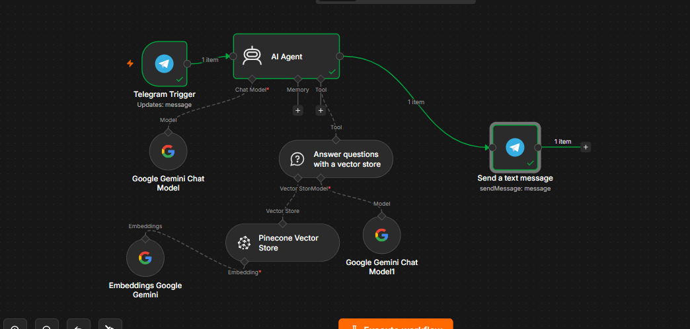

# Guest Agent — AI Hotel Concierge (RAG + Tool-Calling Agent)


> A conversational AI concierge for La Roche Hotel, built in n8n, combining retrieval-augmented generation (RAG) over real hotel policies with tool-calling for bookings and human escalation — with explicit guardrails against hallucination.

## Why this project

13 years in hotel front office and operations (Duty Manager / Reception Manager / Night Auditor) means answering the same guest questions hundreds of times over — check-in times, cancellation rules, parking, pets, breakfast hours. This project asks: what happens if a guest could just message a bot and get accurate answers instantly, with a real human safety net for anything outside the bot's knowledge?

## Architecture

Two separate n8n workflows:

**1. Guest Agent – Knowledge Base Setup** (Manual Trigger, one-time/on-demand)
- Reads the hotel's policy document
- Splits it into one clean chunk per policy section (Check-in/out, Cancellation, Parking, Wi-Fi, Breakfast, Pets, Payment, Extra Guests)
- Embeds each chunk with Google's `gemini-embedding-001` model (3072 dimensions)
- Stores the vectors in a Pinecone serverless index (cosine metric)

**2. Guest Agent – Live** (Telegram Trigger, dedicated bot)
- Receives guest messages via a dedicated Telegram bot (HotelConciergeBot)
- An AI Agent (Gemini) decides which of 3 tools to use per message:
  - **Knowledge Base Search** — vector search over the policy index (RAG)
  - **Booking Lookup** — looks up mock guest bookings by reference number
  - **Escalate to Human** — alerts staff and tells the guest honestly when something is outside scope
- A strict System Message prevents the model from answering anything — including general-knowledge questions like local directions — from outside its tools

```
Telegram Trigger → AI Agent (Gemini) ─┬→ Knowledge Base Search (Pinecone + Gemini embeddings)
                                       ├→ Booking Lookup (Code Tool)
                                       └→ Escalate to Human (Telegram tool)
                                            ↓
                                    Send reply → Guest
```

## Screenshots

**1. Guest Agent – Knowledge Base Setup** (ingestion: policy doc → chunked → embedded → inserted into Pinecone):


**2. Guest Agent – Live** (AI Agent with all 3 tools wired and tested — knowledge base search, booking lookup, escalate to human):



## Tech stack

| Layer | Tool |
|---|---|
| Orchestration | n8n |
| LLM | Google Gemini (Chat Model) |
| Embeddings | Google `gemini-embedding-001` (3072-dim) |
| Vector store | Pinecone (serverless, cosine metric) |
| Messaging | Telegram Bot API |
| Mock data | Inline JS (Code Tool node) |

## Knowledge base

The policy document (`hotel_policies.md`) covers 8 sections: Check-in/Check-out, Cancellation, Parking, Wi-Fi, Breakfast, Pets, Payment Methods, and Extra Guests/Children. Each section is stored as its own independent vector, so retrieval returns one complete, self-contained topic per guest question rather than arbitrary character-count chunks.

## Key debugging lessons

- **Cross-workflow connections don't exist.** The ingestion workflow's Pinecone node and the live agent's Pinecone node are two separate node instances in two separate workflows — n8n can't wire across workflow boundaries. Each workflow needs its own fully-configured copy, with the operation mode set correctly (Insert vs. Retrieve).
- **Dimension matching is non-negotiable.** `gemini-embedding-001` defaults to 3072 dimensions; the Pinecone index must be created with that exact number, or every insert fails.
- **Don't assume line breaks survive copy-paste.** A text splitter that depends on a literal newline before each heading silently returns zero results if the source text gets flattened into one line during pasting. Splitting directly on the heading pattern itself is more robust than relying on line breaks.
- **Sub-nodes need every connector filled.** The "Answer questions with a vector store" tool needs *both* a Vector Store *and* its own Model sub-node connected — missing either throws a clear but easy-to-miss error.
- **No System Message means no guardrails.** Without an explicit instruction forbidding it, the underlying LLM will confidently answer general-knowledge questions (e.g. "where's the Ministry of Interior?") as if it were hotel-verified information. A clear System Message restricting the agent to its tools — and instructing it to escalate honestly instead of guessing — fixed this without breaking existing tool use.

## Status

- ✅ Knowledge base ingestion (8 policy chunks, dimension-matched)
- ✅ Tool 1 — Knowledge Base Search (RAG)
- ✅ Tool 2 — Mock Booking Lookup
- ✅ Tool 3 — Escalate to Human
- ✅ Hallucination guardrail (System Message)

## Author

**Khoshaba Odeesho** — 13+ years in hotel operations, now building AI/automation systems that bridge hospitality experience with practical engineering.
